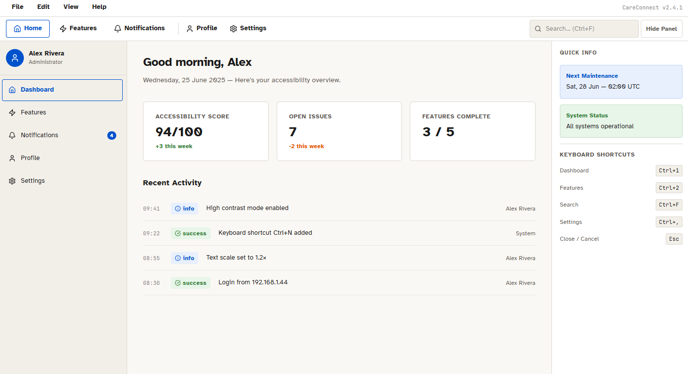

# CareConnect - Desktop (Electron + React), SWEN 661 - Week 8

A desktop-first and keyboard-first, WCAG 2.2 AA rebuild of the CareConnect
health portal. It includes native menus, keyboard shortcuts, React-based
renderer widgets, keyboard navigation testing, and Windows packaging support.



The app opens on a login screen. Once you are in, it gives you a native menu bar with
real accelerators (File, Edit, View, Help), a contextual toolbar, a sidebar, and a
right-hand info panel. The screens are Login, Dashboard, Notifications, a Profile that
has a view and an edit mode, and a tabbed Settings page covering General, Accessibility,
Keyboard, and About.

Everything is built keyboard-first. Every primary action has a key binding, the toolbar
and sidebar and settings tabs all move with the arrow keys, and a dialog traps focus and
closes on Esc. The accessibility work includes a high-contrast AAA theme, text scaling
from 0.8x to 2.0x, a reduce-motion setting, wider text spacing, a left-handed layout,
live-region announcements, 44px hit targets, and visible focus rings. Preferences are
saved in localStorage, so they survive a restart.

## Run it

```bash
cd careconnect-desktop
npm install
npm start
```

You need Node 18 or newer (it was built and tested on Node 22). The install step pulls
Electron down with it.

There is no backend, so any reasonable-looking email and any non-empty password will
sign you in. Try `you@example.com` with `password`.

## Test and coverage

```bash
npm test
```

Jest + React Testing Library are configured with coverage thresholds aligned to
the 60% minimum requirement.

## Accessibility testing

Automated accessibility checks run with axe-core (via `jest-axe`) as part of the suite:

```bash
npm run test:a11y     # axe-core over the login screen and app shell
```

It asserts that both states have no axe violations, and it also checks the skip link, the
input labelling, the `aria-current` markers, and the live region. For the axe DevTools
screenshot, run the [axe DevTools](https://www.deque.com/axe/devtools/) extension against
the running app after `npm start`. The jsdom run skips the axe `color-contrast` rule, since
jsdom has no layout engine, so the contrast is documented and verified with the extension
instead.

Full accessibility documentation:
- [docs/VPAT.md](docs/VPAT.md) — WCAG 2.1 Level AA conformance (VPAT 2.5)
- [docs/TESTING_CHECKLIST.md](docs/TESTING_CHECKLIST.md) — keyboard + screen-reader checklist
- [docs/SCREEN_READER_SCRIPT.md](docs/SCREEN_READER_SCRIPT.md) — VoiceOver walkthrough script
- [docs/ACCESSIBILITY.md](docs/ACCESSIBILITY.md) — focus order, focus states, WCAG mapping

## Package (Windows)

```bash
npm run package:win
```

## Project layout

```
careconnect-desktop/
├─ test/
│  ├─ keyboard-utils.test.js
│  ├─ react-widgets.test.js
│  └─ accessibility.test.js   # axe-core (jest-axe) audit of login + app shell
├─ src/
│  ├─ main.js            # Electron main process and the native menu bar
│  ├─ preload.js         # contextBridge: menu channel and auth state (no Node in the renderer)
│  └─ renderer/
│     ├─ index.html      # App shell, SVG icon sprite, login and shell markup
│     ├─ styles.css      # Design system: tokens, light and high-contrast themes, components
│     ├─ keyboard-utils.js # Shared roving keyboard navigation utility
│     ├─ react-widgets.js  # React widget renderer used in settings
│     └─ app.js            # Routing, screen rendering, keyboard, focus, accessibility settings
└─ docs/
   ├─ KEYBOARD_SHORTCUTS.md   # The full shortcut sheet
   ├─ ACCESSIBILITY.md        # Focus order, focus states, WCAG mapping
   ├─ VPAT.md                 # WCAG 2.1 AA conformance (VPAT 2.5)
   ├─ TESTING_CHECKLIST.md    # Keyboard + screen-reader checklist
   └─ SCREEN_READER_SCRIPT.md # VoiceOver walkthrough script
```

## Keyboard quickstart

| Shortcut | Action |
|----------|--------|
| `Ctrl+1` / `Ctrl+2` / `Ctrl+3` | Dashboard, Notifications, Profile |
| `Ctrl+F` | Focus search |
| `Ctrl+,` | Open Settings |
| `Ctrl+N` | New record |
| `Ctrl+S` | Save |
| `Ctrl+Alt+H` | Toggle high contrast |
| `Ctrl+Alt+L` | Toggle left-handed layout |
| `F1` | Shortcut help |
| `Esc` | Close a dialog |

The full reference is in [docs/KEYBOARD_SHORTCUTS.md](docs/KEYBOARD_SHORTCUTS.md), and the
accessibility write-up is in [docs/ACCESSIBILITY.md](docs/ACCESSIBILITY.md).

## Security

The renderer runs with `contextIsolation` on, `nodeIntegration` off, a strict CSP, and a
narrow preload bridge. External links open in the operating system browser rather than in
the app.
